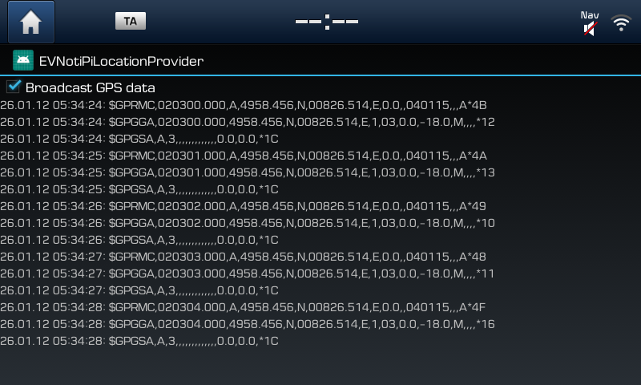
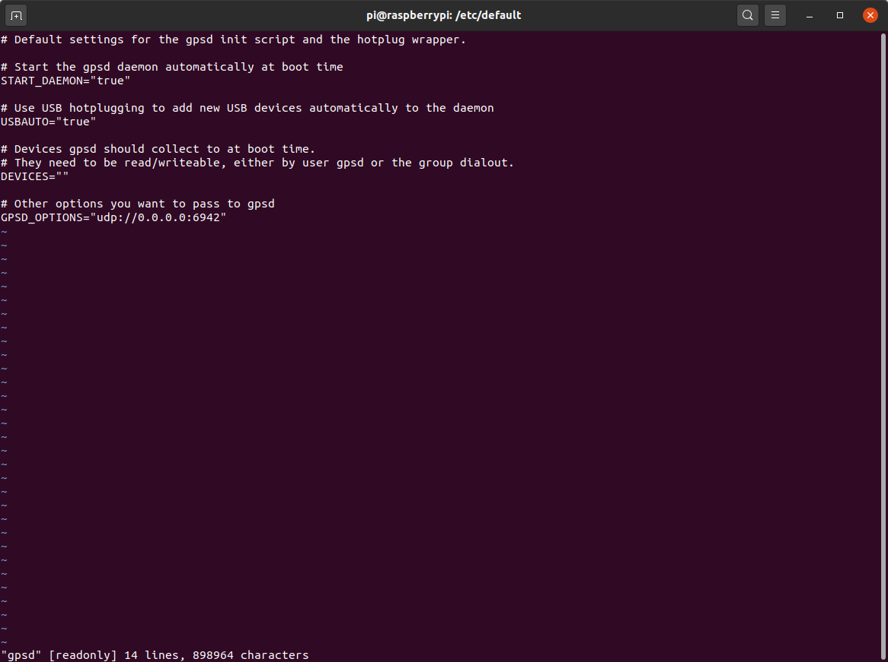

# EvNotiPiLocationProvider
Broadcasts GPS location, timestamp and speed. Built for Hyundai Ioniq EV (28kWh).

How-To:
* Make sure the Raspberry and the head unit are using the same WiFi network!
* Install app and enable "Broadcast GPS data"
* Edit /etc/default/gpsd on your Raspberry according to:

If you like my work I'd be happy if you buy me a coffee. Thanks! 

